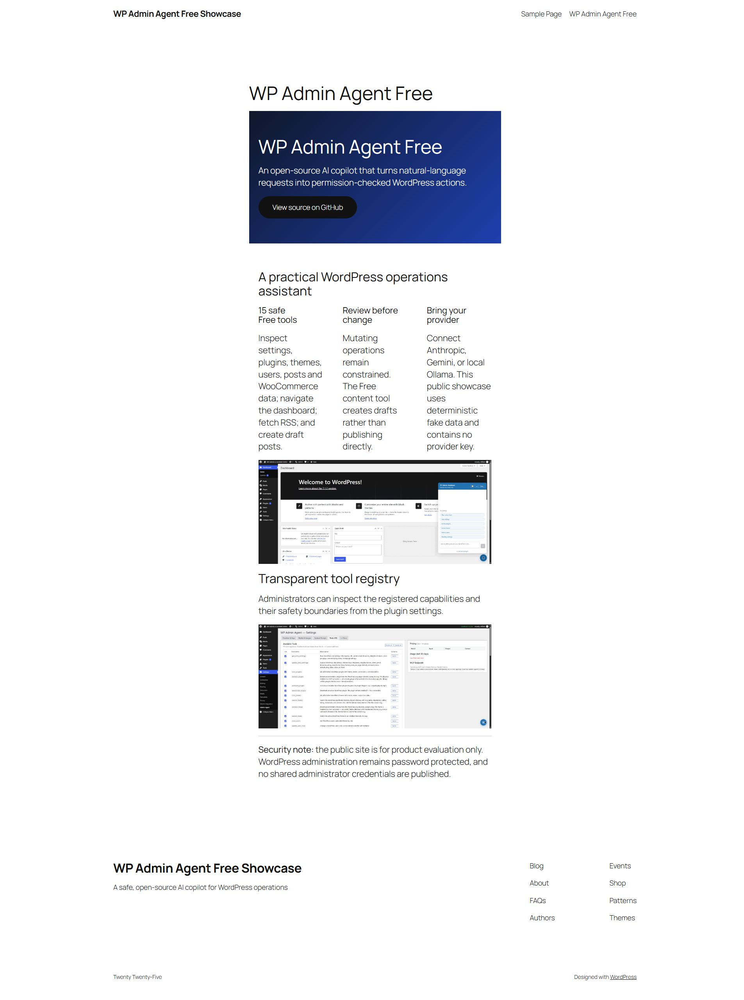
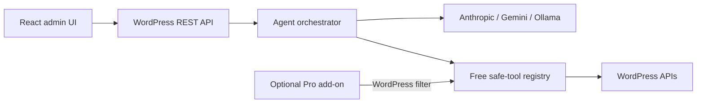

# WP Admin Agent

WP Admin Agent is a privacy-conscious AI assistant inside WordPress Admin. It connects to an administrator-selected Anthropic, Google Gemini, or Ollama model and exposes a controlled set of WordPress tools for inspection, navigation, and safe draft workflows.

This repository contains the GPL-licensed Free edition. A separate Pro add-on provides higher-risk operational tools, advanced WooCommerce workflows, policy controls, and commercial support.

## Free edition

- Chat assistant embedded in `wp-admin`
- Anthropic, Google Gemini, and self-hosted Ollama providers
- Streaming responses over Server-Sent Events
- Read-only inspection of posts, plugins, themes, users, WooCommerce, and Wordfence state
- WordPress draft creation that never publishes automatically
- Conversation history and audit metadata
- Configurable tool allow-list
- Encrypted provider credentials using WordPress security keys
- Authenticated MCP-compatible JSON-RPC endpoint

## Product tour

Try the public, fake-data showcase at [wp-admin-agent-showcase-cd6tjmxetq-as.a.run.app](https://wp-admin-agent-showcase-cd6tjmxetq-as.a.run.app/). The showcase does not publish administrator credentials or contain an AI-provider key.




## Requirements

- WordPress 6.5 or newer
- PHP 8.2 or newer with OpenSSL
- A WordPress administrator account with `manage_options`
- HTTPS on internet-accessible sites
- Anthropic or Gemini credentials, or a reachable Ollama server

## Install from GitHub

```bash
cd /path/to/wordpress/wp-content/plugins
git clone https://github.com/williamduong/wp-admin-agent.git
wp plugin activate wp-admin-agent
```

Compiled frontend assets are included in tagged releases. Pin a reviewed release instead of tracking `main` on production sites.

## Configure

1. Open **Settings → WP Admin Agent**.
2. Select Anthropic, Gemini, or Ollama.
3. Enter the provider configuration and test the connection.
4. Review enabled tools and disable anything the site does not need.
5. Start with a read-only request such as “Show active plugins and explain their purpose.”

See [Getting Started](docs/getting-started.md) and the illustrated [User Guide](docs/user-guide.md).

## Free and Pro architecture



The Free plugin owns the provider, orchestration, storage, UI, and extension hook. Pro registers additional tool instances through `waa_admin_agent_tool_instances`; premium implementation code is not required by the Free package.

## Development

```bash
npm ci
npm run build
npm run lint
npm run test:js
```

PHP development, package creation, and contribution guidance are in [Development](docs/development.md).

## External services and privacy

The plugin contacts an AI provider only after an administrator selects and configures it. Prompts, conversation context, tool schemas, and relevant WordPress information can be sent to that provider to fulfill administrator requests. Optional user-initiated tools may contact Iconify or selected RSS publishers. Full disclosures and service policy links are in [`readme.txt`](readme.txt).

Do not submit secrets, regulated data, or unnecessary personal data in prompts. Review the [Security Guide](docs/security.md) before production use.

## Documentation

- [Documentation index](docs/index.md)
- [Getting Started](docs/getting-started.md)
- [User Guide](docs/user-guide.md)
- [Architecture](docs/architecture.md)
- [Security](docs/security.md)
- [Development](docs/development.md)

## License

WP Admin Agent Free is licensed under `GPL-2.0-or-later`. See [LICENSE](LICENSE).
