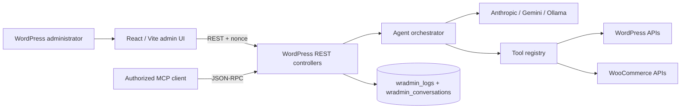
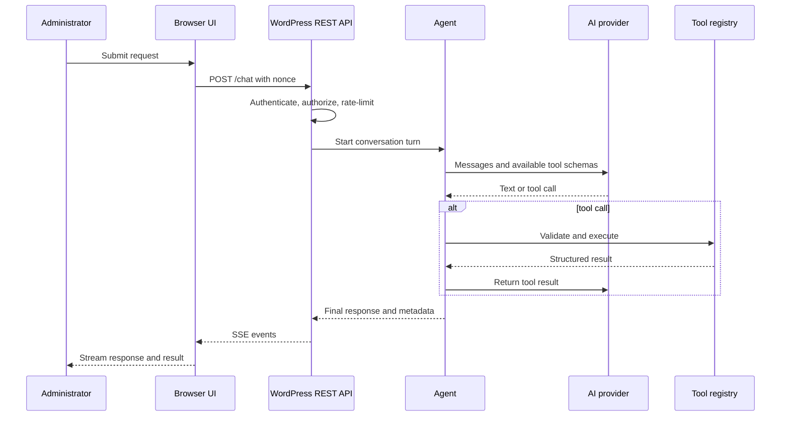

# Architecture

## System context

The plugin is a WordPress/PHP backend with a React/Vite administration interface. WordPress remains the trust boundary: it authenticates the user, checks capabilities, stores configuration, invokes model providers, and executes tools.

## Main components

| Component | Responsibility |
|---|---|
| React admin application | Chat, settings, tool controls, history, documentation, and usage views |
| REST controllers | Nonce validation, capability checks, input handling, streaming, and JSON responses |
| Agent orchestrator | Provider conversation loop, tool selection, tool results, and iteration limits |
| Provider adapters | Normalize Anthropic, Gemini, and Ollama requests and responses |
| Tool registry | Registers 15 Free tools and accepts extension tools through a WordPress filter |
| Pro add-on | Registers premium operational tools without placing their implementation in the Free package |
| Storage layer | Settings in WordPress options; logs and conversations in plugin tables |
| MCP endpoint | Exposes selected tools through authenticated JSON-RPC |

## Chat request lifecycle

The orchestration loop is capped at 10 tool iterations per request. The REST layer applies a rate limit of 30 requests to protected agent endpoints according to the plugin's configured rate-limit window.

## Provider contract

Provider adapters translate a common message/tool format to each vendor API. This keeps model-specific HTTP payloads out of the UI and tool implementations. Provider secrets remain server-side.

## Tool model

Each tool defines a machine-readable name, description, input schema, execution handler, and safety metadata. The registry exposes enabled tool schemas to the model, validates the selected call, and executes it through WordPress APIs. Site capabilities, plugin availability, and hosting permissions may further constrain a tool.

## Persistence

The plugin creates two prefixed tables:

- `<prefix>wradmin_conversations` stores conversation records and messages.
- `<prefix>wradmin_logs` stores execution and usage metadata.

General settings and encrypted credentials are stored using WordPress options. The actual prefix is the site's configured `$table_prefix`.

## REST API

Namespace: `wp-admin-agent/v1`

| Route | Methods | Purpose |
|---|---|---|
| `/chat` | POST | Run a streamed assistant turn |
| `/test-connection` | POST | Test provider configuration |
| `/conversations` | GET, POST | List or create conversations |
| `/conversations/{id}` | GET, POST, DELETE | Read, update, or delete one conversation |
| `/settings` | GET, POST | Read or update plugin settings |
| `/stats` | GET | Retrieve usage statistics |
| `/pricing` | GET | Retrieve model pricing metadata |
| `/ollama-models` | GET | List available Ollama models |
| `/mcp` | POST | Handle MCP JSON-RPC requests |

All routes require `manage_options`. Chat, provider testing, and MCP requests are also rate-limited.

## Streaming

Chat responses use Server-Sent Events. Events carry incremental text, tool activity, structured results, errors, and completion metadata. Reverse proxies must allow long-lived responses and avoid buffering the event stream.

## Extension points

- Add a provider by implementing the provider adapter contract and settings UI.
- Add a tool by implementing its schema/handler and registering it with the tool registry.
- Add a UI surface under `src/` and rebuild `assets/`.
- Add MCP capabilities only after applying the same authentication and tool-safety controls.

## Known architectural constraints

- Requests execute within normal WordPress/PHP process limits.
- Conversation and log growth needs an explicit retention policy.
- A model can misunderstand intent; deterministic validation and confirmation remain mandatory.
- Tool execution is only as isolated as the underlying WordPress installation.
