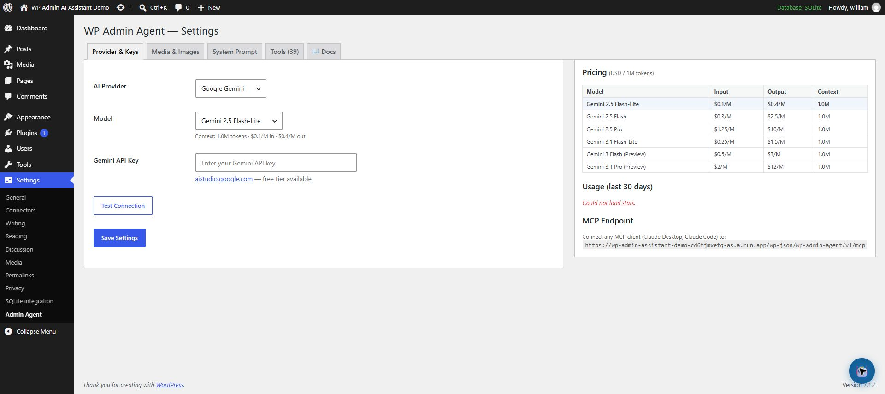
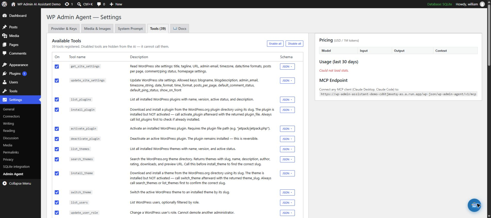

# Getting Started

This guide takes a new administrator from installation to a safe first conversation.

## 1. Check the requirements

- WordPress 6.5+
- PHP 8.2+ with OpenSSL
- An administrator account with the `manage_options` capability
- HTTPS on internet-facing sites
- Anthropic API credentials, Google Gemini API credentials, or a reachable Ollama server

Node.js is required only when rebuilding the React frontend.

## 2. Install the plugin

### Install from Git

```bash
cd /path/to/wordpress/wp-content/plugins
git clone https://github.com/williamduong/wp-admin-asistant.git wp-admin-assistant
wp plugin activate wp-admin-assistant
```

If WP-CLI is unavailable, clone or copy the directory to `wp-content/plugins/wp-admin-assistant`, then activate **WP Admin Agent** from **Plugins → Installed Plugins**.

### Build the frontend from source

The repository includes built assets. To rebuild them after changing `src/`:

```bash
npm ci
npm run build
```

## 3. Configure an AI provider

Open **Settings → WP Admin Agent**.



Choose one provider:

- **Anthropic** — enter an API key and select a Claude model.
- **Gemini** — enter a Google AI API key and select a Gemini model.
- **Ollama** — enter the server URL and select an installed model. Keep private Ollama servers behind an authenticated network boundary.

Use **Test connection** before saving. Provider credentials are encrypted at rest using WordPress key material and are not returned to the browser after storage.

## 4. Review tool access

Open the **Tools** tab and disable tools the site does not require. Apply least privilege: a content-only workflow normally does not need plugin installation, theme changes, or user administration.



## 5. Run a safe first request

Open the floating assistant and begin with a read-only request:

```text
Show the active plugins and summarize what each one does. Do not change anything.
```

Then try a low-risk draft workflow:

```text
Create a draft post outline about our release process. Do not publish it.
```

Inspect the proposed operation and result. Any destructive or high-impact action should require explicit confirmation.

## 6. Production checklist

- Back up the database and `wp-content`.
- Test on staging before production.
- Disable unused tools.
- Use a dedicated, least-privilege provider key with billing alerts.
- Restrict WordPress administrator accounts and require strong authentication.
- Keep WordPress, PHP, plugins, and themes patched.
- Review usage statistics and audit logs.
- Never expose the disposable Cloud Run demo as a production site.

Next: read the [User Guide](user-guide.md) and [Security guide](security.md).
