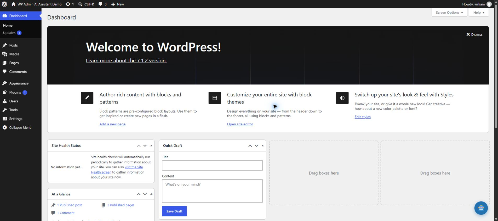
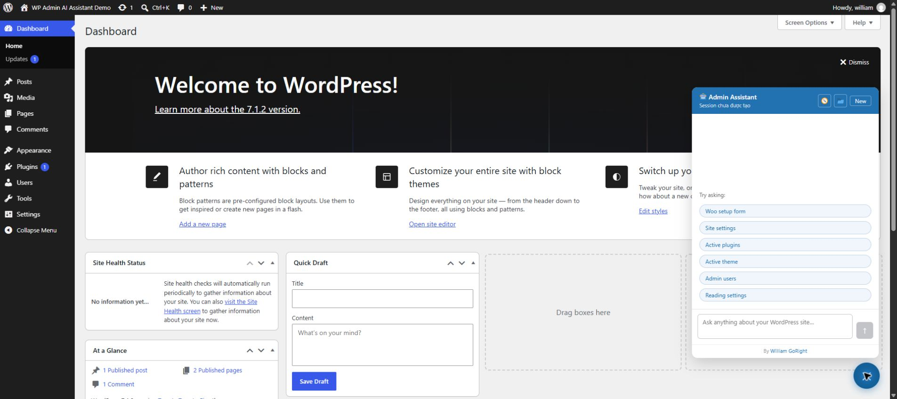
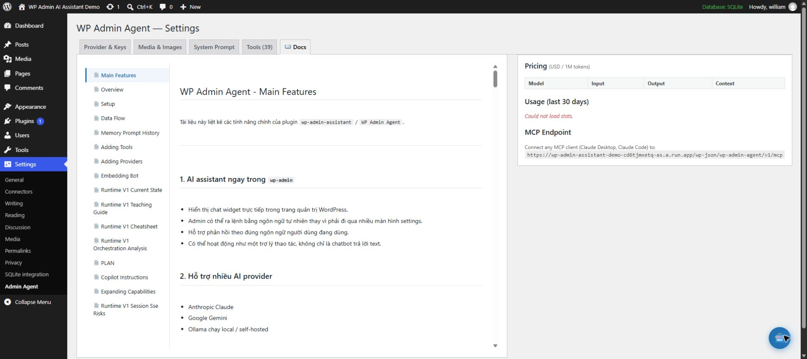

# User Guide

## 1. Find the assistant

After activation, the assistant launcher appears inside WordPress Admin.

Select the launcher to open the chat panel without leaving the current admin page.

## 2. Ask for work in plain language

Good requests state the target, constraints, and desired result. Examples:

- “List inactive plugins and explain whether each is safe to remove. Do not delete anything.”
- “Create a draft post titled ‘September Product Update’ with these five sections.”
- “Find users with administrator access. Return a table; make no changes.”
- “Show WooCommerce orders that need attention this week.”

For complex tasks, ask the assistant to inspect first and propose a plan. Review tool calls and outputs before approving changes.

## 3. Confirm high-impact actions

The tool layer classifies operations by risk. Actions such as deleting content, changing users, installing software, or altering important settings should pause for confirmation. Verify the exact target and expected effect before approving.

If a request is ambiguous, cancel it and restate the request with identifiers such as post ID, username, plugin slug, or order number.

## 4. Continue conversations

Conversation history is stored in WordPress so administrators can return to prior context. Start a new conversation when switching sites, clients, or unrelated operational goals. Do not place passwords, private keys, customer payment data, or unnecessary personal information in prompts.

## 5. Configure providers

The provider settings select which model performs reasoning and tool selection.

- Use **Anthropic** or **Gemini** for hosted inference.
- Use **Ollama** when the WordPress host can securely reach a managed Ollama server.
- Test the connection after changing provider, model, endpoint, or credentials.
- Watch token and cost estimates; actual billing is controlled by the provider account.

## 6. Control available tools

The Free edition registers 15 tools focused on inspection, navigation, and draft creation. WP Admin Agent Pro can register additional operational tools through the extension API:

- Posts, plugins, themes, users, and site-state inspection
- A draft-only post creation workflow
- WordPress Admin navigation and icon search
- Read-only WooCommerce status, product, and order inspection
- RSS retrieval and read-only Wordfence status inspection

Disable capabilities that are not needed. The active WordPress user must also have `manage_options`; tool settings are an additional control, not a substitute for WordPress authorization. Pro tools may add publishing, installation, media, settings, user-role, and WooCommerce mutation capabilities.

## 7. Read built-in help

The plugin includes an in-product documentation tab for quick reference.

This repository documentation is the more complete reference and should be kept in sync with behavior changes.

## 8. Usage, logs, and audit review

The plugin records conversation and execution metadata in WordPress tables. Review provider usage, failures, and high-impact operations regularly. Logs may contain operational context, so include them in the site's retention and privacy policy.

## 9. MCP clients

The REST namespace also exposes an MCP-style JSON-RPC endpoint. It supports `initialize`, `tools/list`, and `tools/call`. Requests still pass through WordPress authentication, authorization, rate limits, and the tool registry. Do not expose WordPress cookies or nonces to untrusted clients.

## Troubleshooting

### The launcher is missing

Confirm the plugin is active, the current user is an administrator, compiled files exist under `assets/`, and no browser console error prevents the bundle from loading.

### Provider test fails

Verify the key, model name, account quota, outbound HTTPS access, and server clock. For Ollama, verify the WordPress server—not only your laptop—can reach the configured URL.

### A tool is unavailable

Check the Tools tab, the user's WordPress capabilities, required plugins such as WooCommerce, and hosting restrictions on filesystem or network operations.

### A response stops while streaming

Check reverse-proxy buffering and timeouts, PHP execution limits, web-server logs, and the browser network response. SSE works best when intermediary buffering is disabled.

### Statistics cannot be loaded

Confirm database tables were created during activation and inspect the WordPress/PHP logs for failed REST requests or database permissions.
